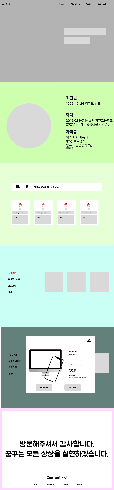
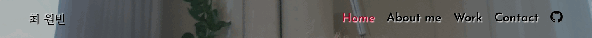
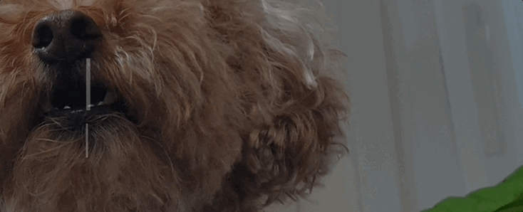
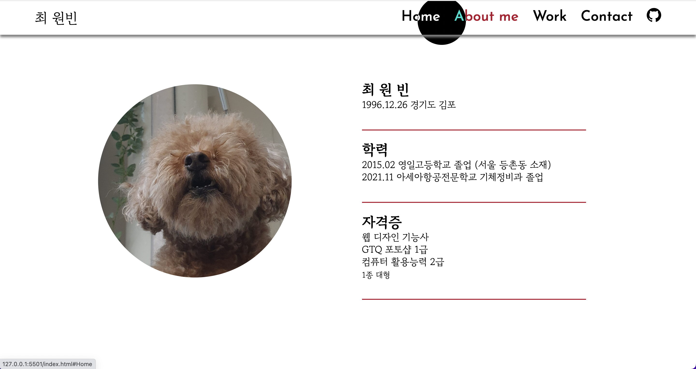
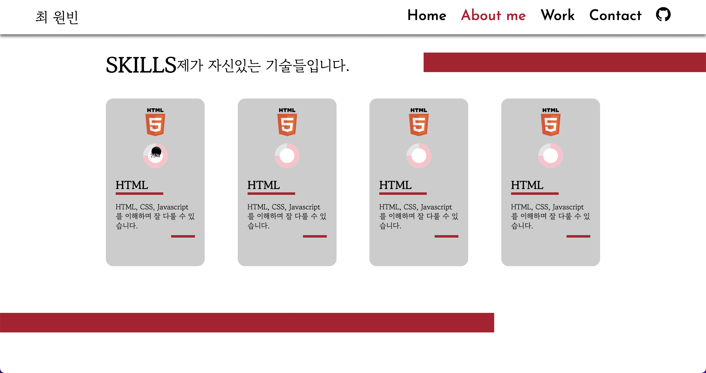
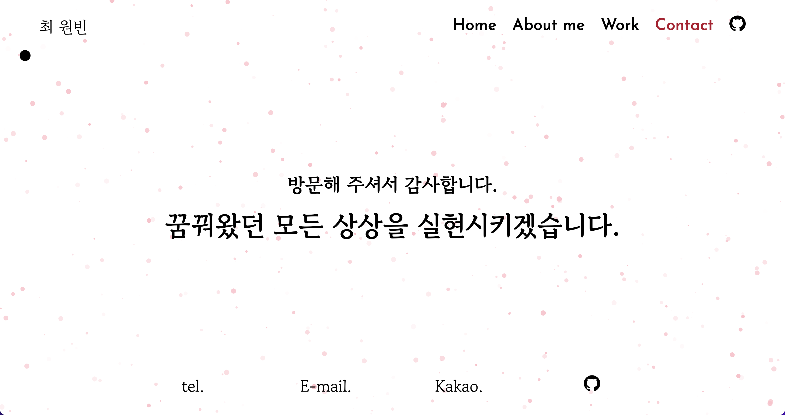

# 최원빈_ 포트폴리오 

데모사이트: https://wb96choi.github.io/binportfolio/ <br><br><br>
피그마 시안: https://www.figma.com/file/Oz9IcbGUiAoIe6nXXh8DPS/%ED%8F%AC%ED%8F%B4..?node-id=0%3A1
-----------------


```
저의 개인 포트폴리오 사이트를 제작하였습니다.
```


## 시안

 <br>

자연스럽게 다음 섹션으로 이동하게끔 만들었습니다.


-----------------

### 메뉴

 <br>
헤더는 스크롤을 감지하여 사라졌다가 나오기도 합니다. <br>
각각의 메뉴는 그 섹션으로 이동시켜줍니다.

-----------------

### Home 섹션

 <br>
사이트에 접속해서 제일 먼저 보이는 홈 섹션입니다. <br>
typeit.js를 이용하여 타이핑을 치는 효과를 주었습니다.

-----------------

### About 섹션

 <br>
clip-path css를 이용하여 배경이미지가 원안에 들어오는 연출을 하였고, <br>
AOS 플러그인으로 애니메이션을 부여했습니다. <br>
그리고 마우스포인터는 색상을 반전시킵니다!
<br><br>
 <br>
섹션의 두번째 층 역시 AOS를 사용해 생동감있는 애니메이션을 부여했고 <br>
아이콘 밑 원을 hover하면 progress bar가 움직입니다.

-----------------

### Work 섹션

 <br>
Work 섹션은 저의 작품들을 간략히 보여주는 슬라이드로 구성되었습니다. <br>
swiper 플러그인의 coverflow옵션을 이용해 3D효과를 구현했고, <br> 
좌측의 메뉴를 클릭함으로 해당 슬라이드로 이동합니다. <br>
상세보기 버튼을 누르시면 해당 작품의 포트폴리오가 나타나고 바깥쪽 어두운 부분을 클릭하면 창이 닫힙니다.

-----------------

### Contact 섹션
<br>
배경은 particle.js로 입자들이 눈처럼 흩날리는 효과를 구현했습니다. <br>
밑의 메뉴들을 클릭하면 제게 전화를 걸수도, 메일을 보내실 수 있으며, 카카오톡 오픈채팅과 깃허브링크로도 이동시켜줍니다!

-----------------

