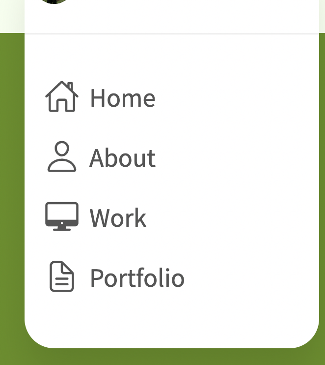
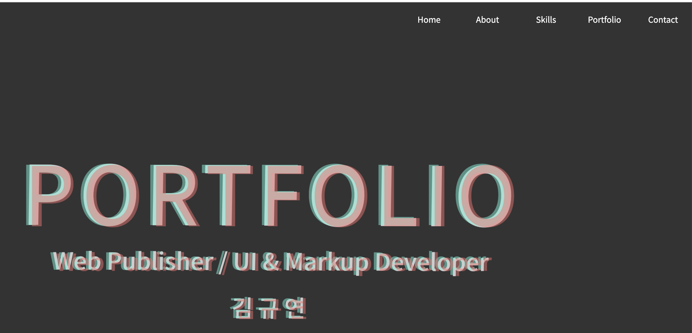
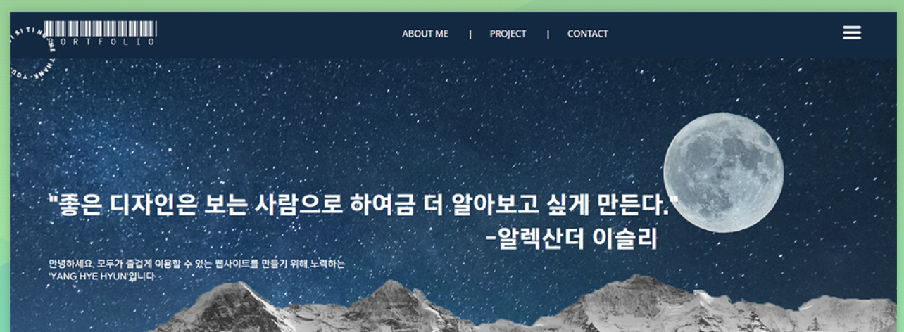
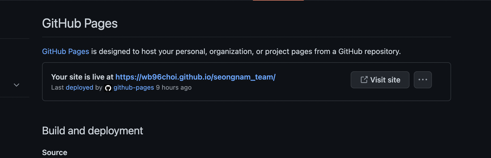
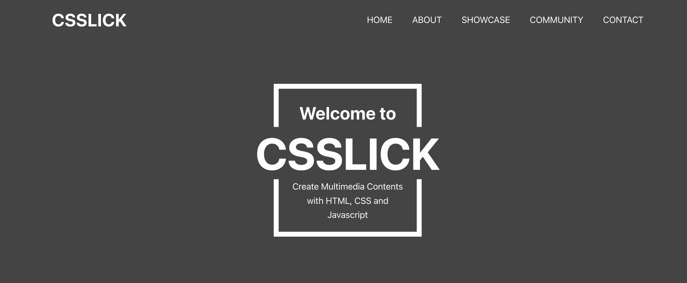
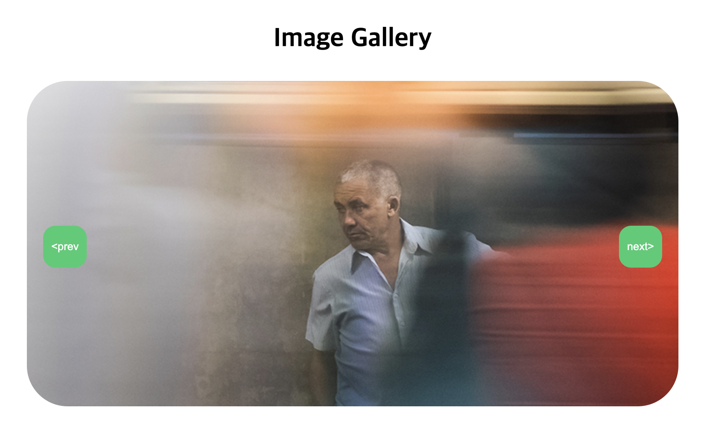
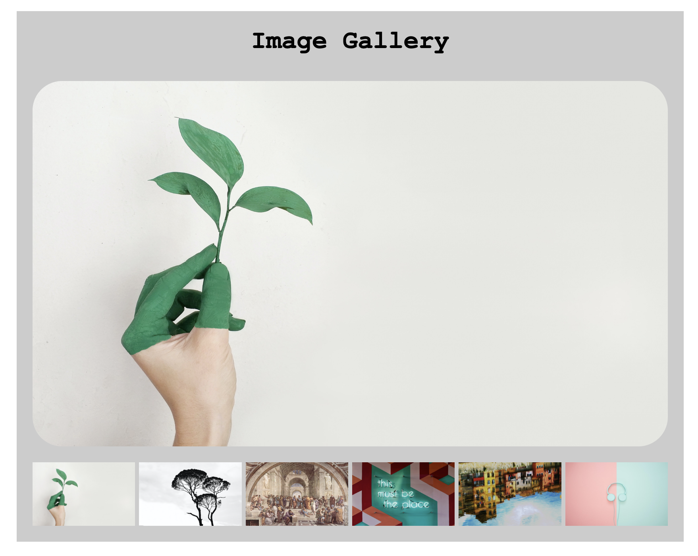
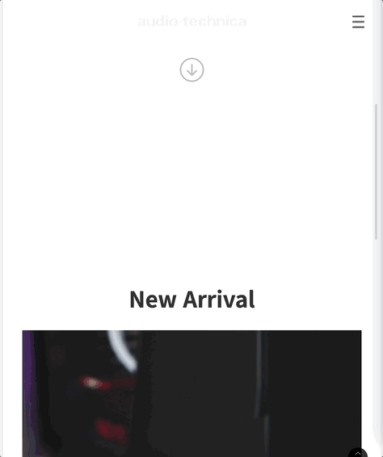
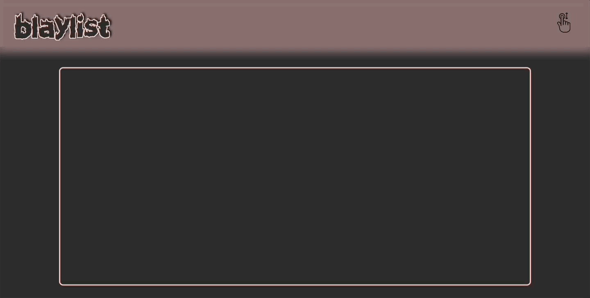

# 최원빈_ 포트폴리오 계획서


-----------------


## 목차

1. 구성
2. 계획
3. 참고 레퍼런스 사이트


-----------------
## 1. 구성
**메뉴**




메뉴 구성은 카페에 올라온 수강생 포트폴리오를 많이 참고 했습니다.
홈으로 가는 메뉴, 나를 소개하는 메뉴, 작업물(작품), CONTACT 를 포함하여 4개 정도로 구성할 예정입니다.


```c
- HOME
- about me
- portfolio(work)
- CONTACT
```


-----------------
**작품으로 넣을 것**
<br>



작품으로 넣어볼 것들을 세 개정도 추려봤는데
수업중에 배웠던 여러가지 이미지 슬라이드들을 한 페이지안에 넣어서 하나의 작품으로 만들면 좋겠다 생각했습니다.
살을 붙이고 다듬어서 "이미지 슬라이드 모음"의 제목으로 하나 만들 예정입니다.




팀 과제로 했던 작품들 역시 수정과 보완을 거쳐 작품으로 넣을 예정입니다.


과제로 제출했던 금연앱 피그마 시안인데 이 역시 코드 잘 따서 모바일 웹으로 만들면 멋있을 것 같아 추가할 예정입니다.

**작품으로 넣을지 고민되는 것**



첫번째 팀과제가 끝나고 나서 팀프로젝트에 열심히 참여했으나 
JSON파일을 팻칭하는 기술은 연마하지 못해 직접 만들어서 연습해 보고자 
저만의 플레이리스트를 소개하는 사이트를 만들어보려고 했던 작품인데 
이것저것 살을 너무 붙여보려다 보니 빠른 시간안에 감당하긴 벅차서 미뤄 두었던 작품입니다.


디지털 시계를 만드는 과제를 조금 창의적으로 풀어보려 만들었던 작품인데
많이 엉성하지만 창의적인 사고력을 길러볼 수 있는 좋은 작품이라 생각해서 좀더 수정 보완을 거친다면 
작품으로 반영해도 좋을 것 같아 고민중입니다.


```c
- 이미지 슬라이드 모음
- 팀 과제때 했던 개인 자료 수정 보완
- 금연앱 시안을 토대로 만든 모바일웹 사이트
    - 플레이리스트
    - 디지털시계 리뉴얼(혹은 그냥 재밌는 사이트 하나 만들어보기)
```


-----------------
## 2. 계획

홈 화면에 이처럼 제 포부를 나타낼수있는 타이포그래피가 있으면 좋을 것 같습니다.

그리고 웬만하면 한페이지안에 다 볼 수 있게 만들 예정입니다. (index.html하나만)

**참고 시안들**


강사님 깃허브에 포트폴리오 링크가 있더군요
제일 깔끔하고 제가 넣고 싶은 정보들을 구성에 알맞게 채워나갈 수 있을 것 같아 생각해 두고 있습니다.


언젠가 음악을 듣고 있었는데 참 이쁜 앨범아트가 눈에 들어와서 캡쳐해뒀습니다.
트랙리스트를 메뉴삼고 쥬얼시디모양으로 코드를 짠다면 씨디모양 포트포리오사이트가 되지 않을까?


재밌는 이미지 슬라이드를 찾던 중에 이런 원형 슬라이드를 봤었는데
이걸 활용한다면 원형 슬라이드(씨디라 하겠습니다.)를 우측에 두고 시디를 돌릴때마다 다른 메뉴들이 전체적으로 보이게 한다면 멋있는 사이트가 될 것 같습니다.

https://codepen.io/nevernotsean/pen/ENQgoW
물론 코드가 꽤 복잡해 제껏으로 만들려면 오랜 시간이 필요하겠지만요...
