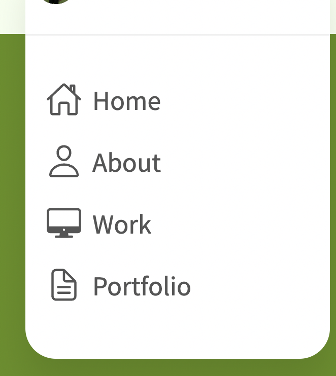
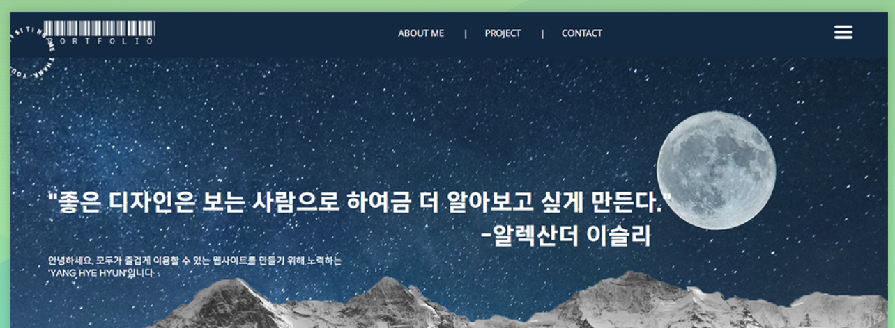
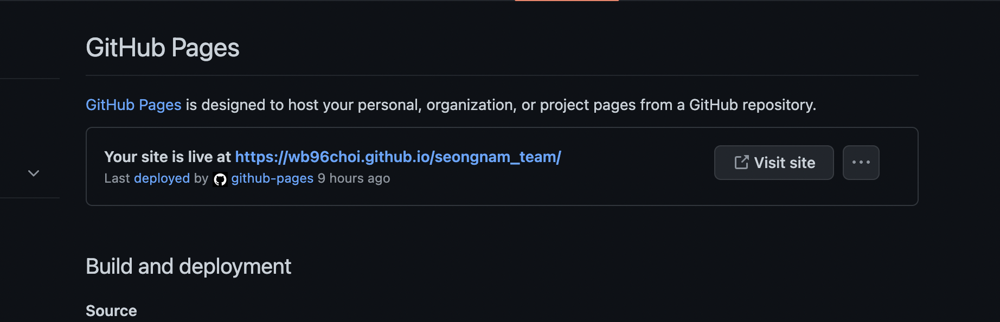
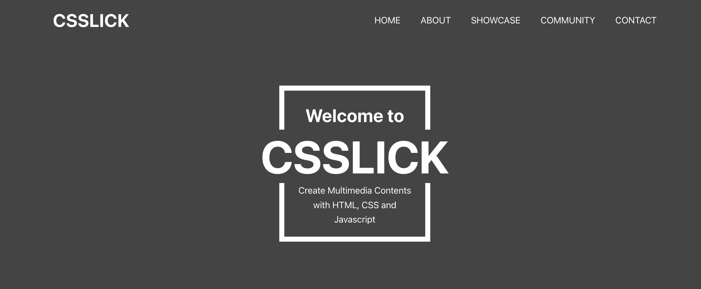

# 최원빈_ 포트폴리오 계획서

데모사이트: https://wb96choi.github.io/binportfolio/ <br>
피그마 시안: https://www.figma.com/file/Oz9IcbGUiAoIe6nXXh8DPS/%ED%8F%AC%ED%8F%B4..?node-id=0%3A1
-----------------

```c
- work섹션 스와이퍼 정돈하기
- 상세소개 페이지 시안을 통일시켜서 모달창으로 띄우기
    - 아니면 pdf라도 띄우도록
```


## 목차

1. 구성
2. 계획
3. 참고 레퍼런스 사이트


-----------------
## 1. 구성
**메뉴**




메뉴 구성은 카페에 올라온 수강생 포트폴리오를 많이 참고 했습니다.
홈으로 가는 메뉴, 나를 소개하는 메뉴, 작업물(작품), CONTACT 를 포함하여 4개 정도로 구성할 예정입니다.


```c
- HOME
- about me
- portfolio(work)
- CONTACT
```


-----------------
**작품으로 넣을 것**
