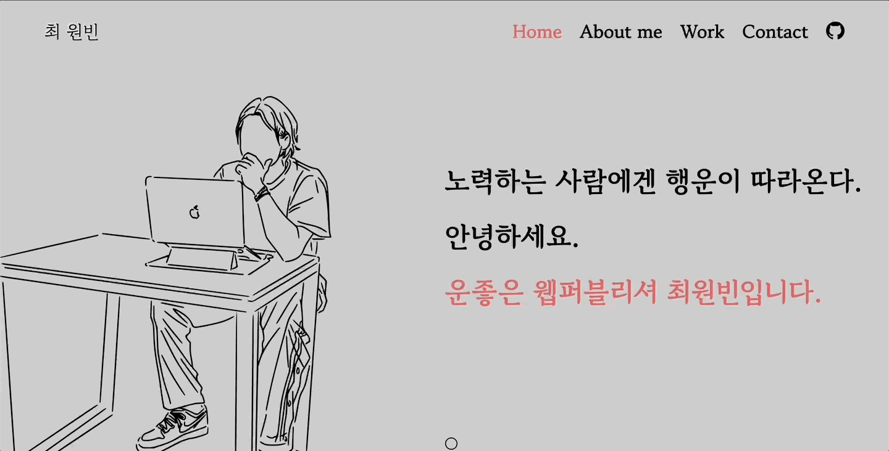
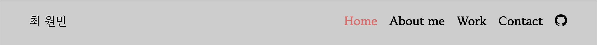
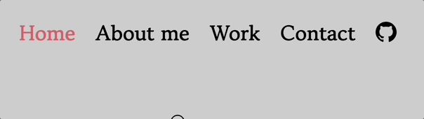
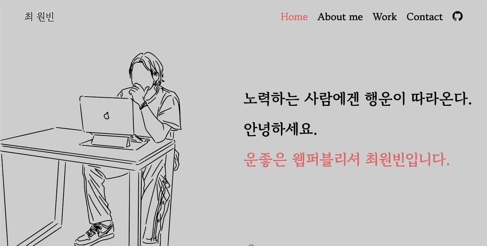
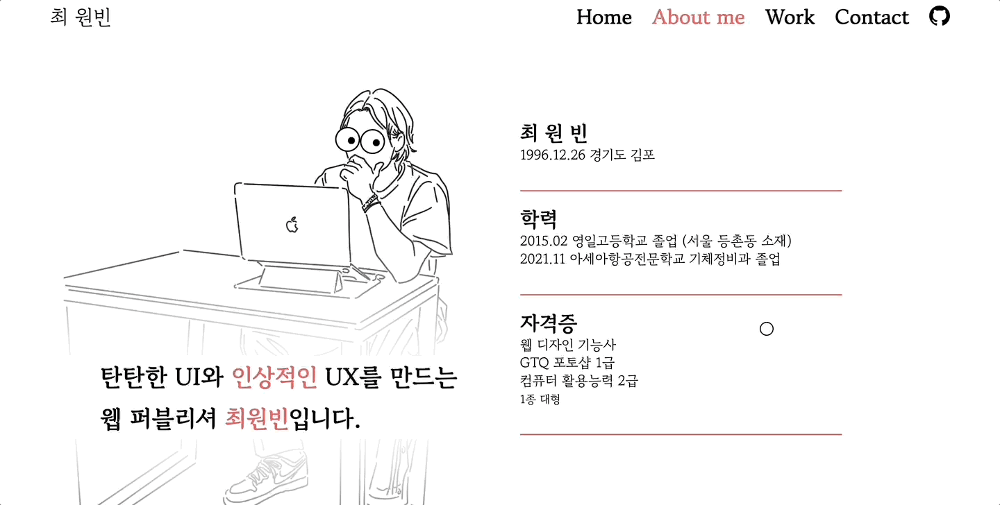
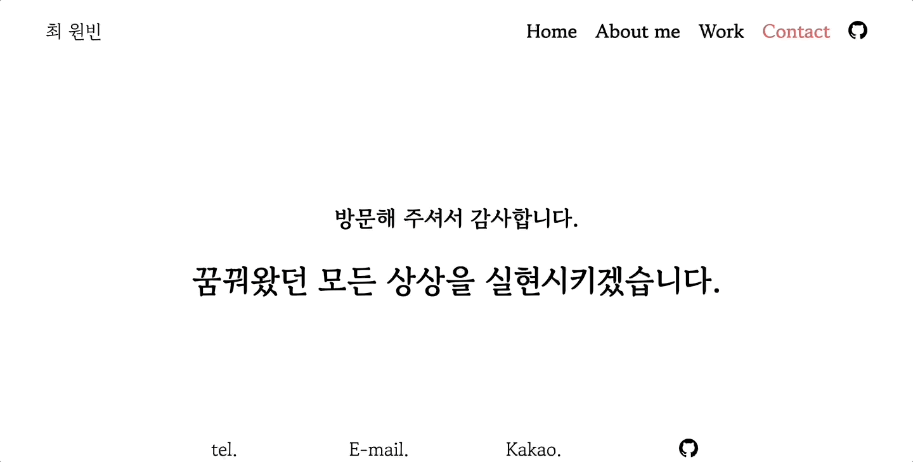
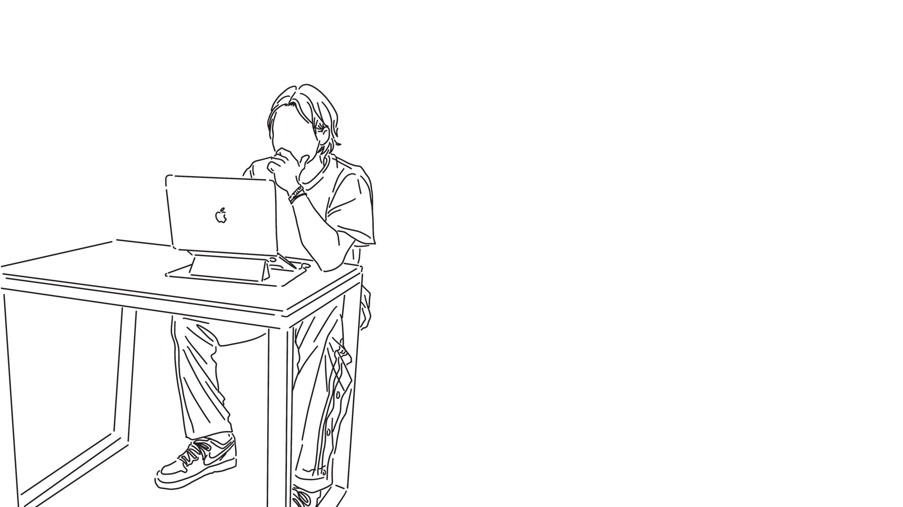

# 최원빈_ 포트폴리오 

사이트: https://wb96choi.github.io/binportfolio/  

-----------------

저의 개인 포트폴리오 사이트를 제작하였습니다.
 
사이트에 접속하면 제일 먼저 볼 수 있는 메인화면은  svg애니메이션으로 꾸며보았습니다.

### 메뉴

  
헤더는 스크롤을 감지하여 height값이 줄어들기도, 원래대로 돌아오기도 합니다.  
각각의 메뉴는 네비게이터의 역할을 해서 그 섹션으로 이동시켜줍니다.

-----------------

### 마우스포인터

  
보편적인 화살표 모양의 커서를 숨기고 직접 만든 커서를 적용시켰습니다. 
클릭이 가능한 요소에 커서를 가져다 대면 커서가 커지고  
테두리 부분은 색반전을 시키는 코드를 적용했습니다.(mix-blend-mode:difference;)

-----------------

### About 섹션

  
마우스위치에따라 위치가 변하는 코드를 사용해 마우스를 쳐다보는듯한 재치있는 연출을 했습니다. 
  
  
섹션의 두번째 층 역시 AOS를 사용해 생동감있는 애니메이션을 부여했고  
원형 progress bar는 스크롤이 해당위치에 도달하면 채워집니다.

-----------------

### Work 섹션

  
Work 섹션은 저의 작품들을 간략히 보여주는 슬라이드로 구성되었습니다.  
swiper 플러그인의 coverflow옵션을 이용해 3D효과를 구현했고,   
좌측의 메뉴를 클릭하거나 화살표를 누름으로 해당 슬라이드로 이동합니다.  
상세보기 버튼을 누르시면 해당 작품의 포트폴리오가 나타나고 바깥쪽 어두운 부분을 클릭하면 창이 닫힙니다.
  
기타메뉴에는 수업시간에 배웠던 것으로 만든 아주 간단한 사이트를 소개하는 부분으로 채웠습니다. 상세보기를 누르면 해당 사이트가 iframe 모달창을 통해 나타납니다.

-----------------

### Contact 섹션
 
앞서 홈섹션에서 보신 것처럼 마우스를 따라 움직이는 애니메이션으로 감사인사를 전합니다. 
밑의 메뉴들을 클릭하면 제게 전화를 걸수도, 메일을 보내실 수 있으며, 카카오톡 오픈채팅과 깃허브링크로도 이동시켜줍니다!

-----------------

